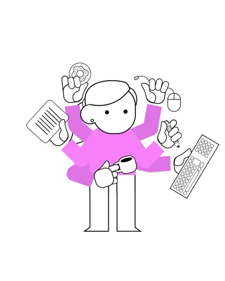

  
   

<h1 align="center" >
  Welcome to Le Kieu's profile!
  
   
  
</h1>

##  **_About Me_**

 I am currently working as a **Frontend Developer** in the fields of **Mobile Development** and **Frontend Development**

 I am a graduating student with a Bachelor's degree in E-commerce from the **[University of Information Technology - Vietnam National University - Ho Chi Minh City](https://www.uit.edu.vn/)**

 I'm focus on learning **Web Development**

 I want to improve my skills to become a **Fullstack Software Engineer**

   In my free time, I pursue **UI/UX Design**

 I have a knowledge in **`Frontend Development` `Web Development` `Backend Development` `RESTful API` `Object Oriented Programming` `Data Structures and Algorithms`**

## 🌐Socials

<!--  -->

<!--  -->

# 💻Tech Stack  
               
 

### ✍️Random Dev Quote

  <h3>
  🥰 Thanks for watching my profile! Have a nice day! 😘  
  &copy; 2024 Le Thi Kieu
  </h3>
  
  

